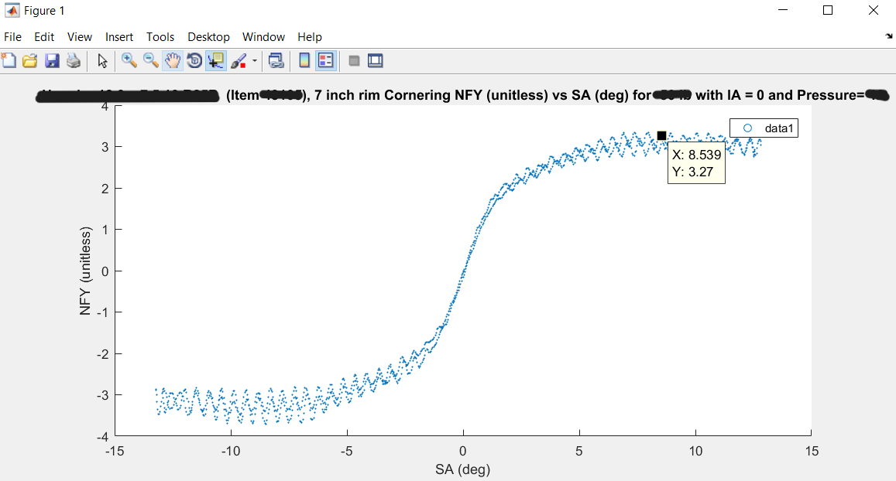

# Tire Analysis and Vehicle Dynamics - 2018-2020
Tire Analysis for Formula SAE (formula Student)

This work was done in 2018, and was the basis for 2019-2020 strategy / systems engineering analysis to generate car requirements based on performance goals ([Point sensitivity]()), and in the [Capstone project]() - designing an Electric racecar. 

This work used tire data from "TTC" (Tire Testing Consortium), which is propriatary and cannot be publicly shared. I am sharing a few graphs with the identifying information removed. 

The data is in csv or matlab files, and is ~60k rows of data from tire test "sweeps", where a tire is cycled through various conditions with sensors reporting speed, angle, displacement, forces and torques for each axis (Fx, Fy, Fz, Mx, My, Mz). These forces and torques at the various angles and speeds were the drivers of various design decisions - 

- Suspension geometry, to put the tire in an "optimal" angle (Camber/ Toe) for the majority of a racing course 
- Steering geometry, to balance low speed manuvering and high speed grip (each tire needs a different angle at varying loads)
- Tire choice: various tires are tested, and the data should ideally save on expensive real-world testing of many tire models. 

In the end, tires were chosen, and the 2019 and 2020 analysis built on this work by analysing temperature behavior, and going into more depth on steering behavior. However, the core analysis here was still referenced

The raw data from a single sweep was extracted in Matlab ([MatlabTireAnalyzerCalculatorInterpSA.m](MatlabTireAnalyzerCalculatorInterpSA.m)), while some initial analysis was done in Excel ([Weight_transfer_with_load_sensitivity](Weight_transfer_with_load_sensitivity)). 

>NFY = mormalized lateral (cornering) coefficient of the tire. SA = slip angle (degrees) - angle of the rim relative to the contact patch direction

Some data was obtained from testing with displacement sensors (linear potentiometers) on the prior year car. 

>The data gives an indication of operating parameters, and validates choices made in the prior year. In this case, the suspension was too soft, and had too much roll angle. 

Top level design goals dependency chart: 

Further process was then as follows: 

>Front suspension geometry, with roll angle as the variable to optimize based on tire analysis 

# Key results 
The first results were "load sensitivity" of the tires. This allows comparing different tires, and extracting grip levels at dynamic loading (under acceleration, tire load varies)

These were extracted from somewhat noisy data: 

Mz "Aligning Torque" was a key factor in designing steering geometry. It should help the driver feel the tires nearing grip limits - the analysis helped find out that the force was being drowned out by mechanical design choices (Caster angle was too high - 7deg). We tested this physically to arrive at a much lower angle (1.5deg). 

Sweeps of Mass and CG (center of gravity) height/fore-aft location effect on car balance and grip were done. These were fairly rudementary, based on a steady state car model. Later on, full lap simulation was done [point sensitivity](). 

Fore-aft location and height helped set the driver position - for instance, driver seat angle affects CG significantly.

>driver position and seating angle

This had to be balanced with component packaging requirements. 

Forces obtained from the vehicle model were then used for strength simulations, using [ForceCalculator2D.m](ForceCalculator2D.m): 

