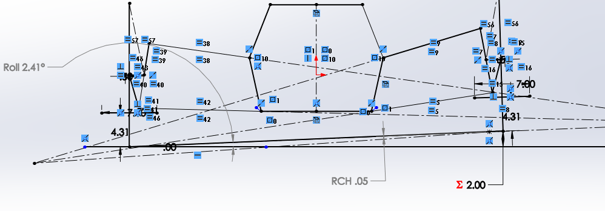
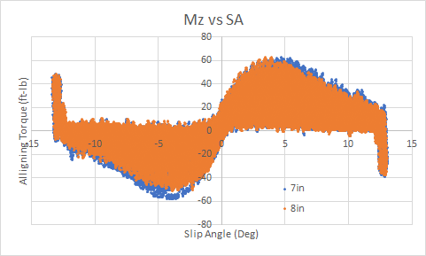
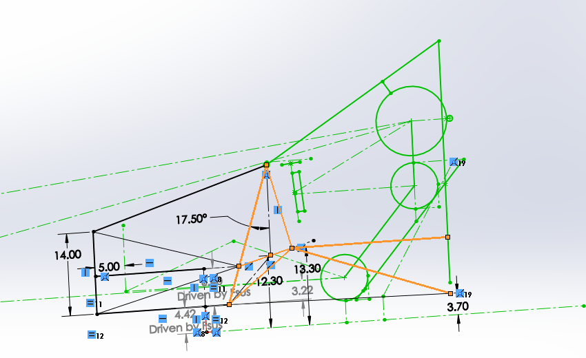
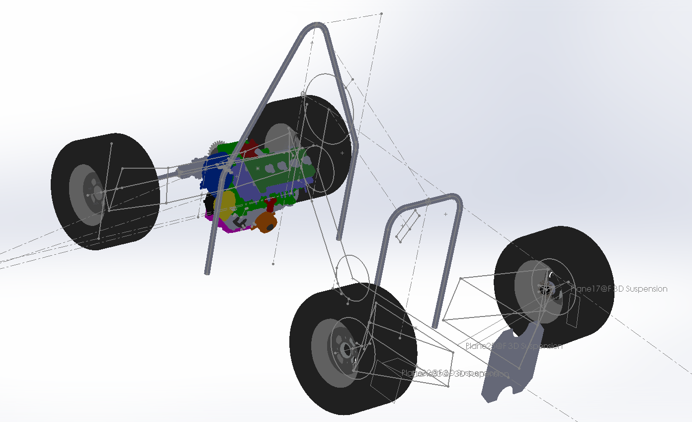
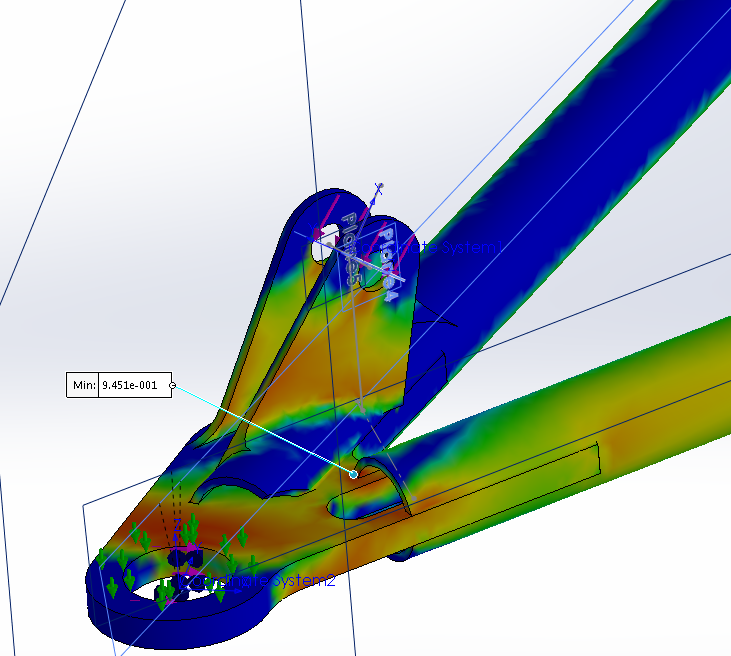
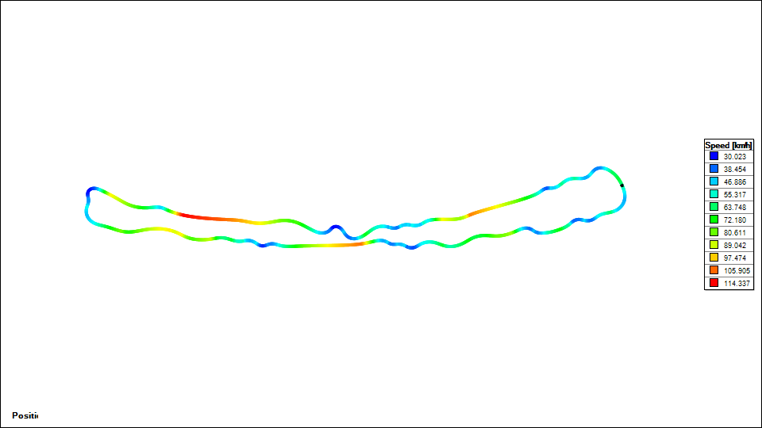
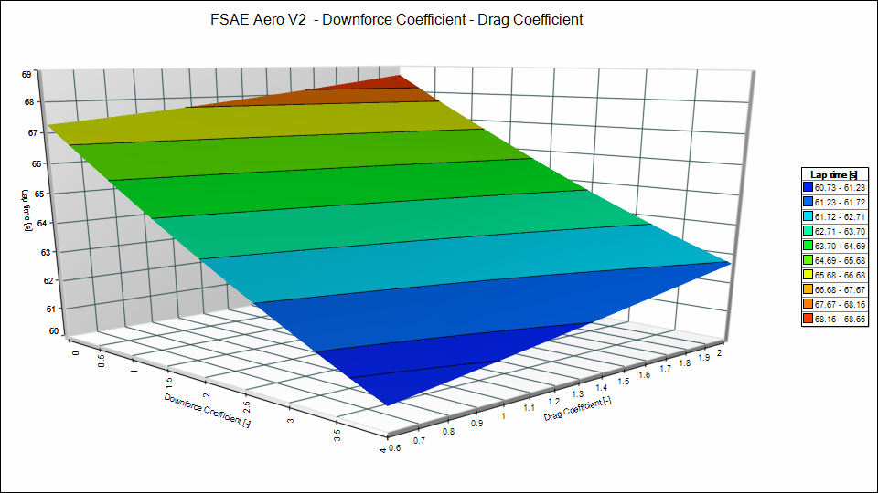

# Tire and Vehicle Dynamics Modelling - 2018-2020
Tire Analysis for Formula SAE (formula Student). The specific results below were not published, so are summarized below. 

This work was done in 2018-2020, and served as the basis for a strategy / systems engineering analysis to generate car requirements based on performance goals ([Point sensitivity](https://www.researchgate.net/publication/392030237_POINT_SENSITIVITY_FSAE_Design_Parameter_Analysis)), and in the [Capstone project](https://www.researchgate.net/publication/392028874_Development_of_an_Electric_Powertrain_System_for_a_Formula_SAE_Race_Car) - designing an Electric racecar. 

>NFY = mormalized lateral (cornering) coefficient of the tire. SA = slip angle (degrees) - angle of the rim relative to the contact patch direction

This work used tire data from "TTC" (Tire Testing Consortium), which is propriatary and cannot be publicly shared. I am sharing a few graphs with the identifying information removed. 

The data is provided per-tire in csv or matlab files, and is ~60k rows of data from tire test "sweeps", where a tire is cycled through various conditions with sensors reporting speed, angle, displacement, forces and torques for each axis (Fx, Fy, Fz, Mx, My, Mz). These forces and torques at the various angles and speeds were the drivers of various design decisions - 

- Suspension geometry, to put the tire in an "optimal" angle (Camber/ Toe) for the majority of a racing course 
- Steering geometry, to balance low speed manuvering and high speed grip (Ackermann steering - each tire needs a different angle at varying loads)
- Tire choice: various tires are tested, and the data should ideally save on expensive real-world testing of many tire models. 
- Aero decisions: tire load varies based on aero load, and later on tradeoffs of ride-height to suspension stiffness also need to be made
- Engine power and gearing: based on available grip and expected lap speeds, optimal gearing can be selected, and prioritization of engine upgrades can be done

The 2018 analysis helped chose tires (as well as validated prior choices), and the 2019 and 2020 analysis built on this work by analysing temperature behavior, and going into more depth on steering behavior.

The raw data from a single sweep was extracted in Matlab ([MatlabTireAnalyzerCalculatorInterpSA.m](MatlabTireAnalyzerCalculatorInterpSA.m)), while some initial analysis was done in Excel ([Weight_transfer_with_load_sensitivity](Weight_transfer_with_load_sensitivity)). 

Some data was obtained from testing with displacement sensors (linear potentiometers) on the prior year car. 

>The data gives an indication of operating parameters, and validates choices made in the prior year. In this case, the suspension was too soft, and had too much roll angle. 

Top level design goals dependency chart: 

Further process was then as follows: 

>Front suspension geometry, with roll angle as the variable to optimize based on tire analysis 

# Summary of Results 
## Load Sesnitivity
The first results were "load sensitivity" of the tires. This allows comparing different tires, and extracting grip levels at dynamic loading (under acceleration, tire load varies)

These were extracted from somewhat noisy data: 

## Steering geometry

Mz "Aligning Torque" was a key factor in designing steering geometry. It should help the driver feel the tires nearing grip limits - the analysis helped find out that the force was being drowned out by mechanical design choices (Caster angle was too high - 7deg). We tested this physically to arrive at a much lower angle (1.5deg). 

Further quantification of this was done later - 

And a better model of steering effort was done - 

## Tire wear

>tire wear after several testing days, showing a bit excessive outside wear 

Tire wear was further validated with temperature probes at the inside, middle, and outside points of the tire. 

>By testing temperatures in a controlled steady state (skidpad) condition, we could validate the tire angle (camber) and tune the suspension. 

## Tire size and temperature analysis

>Comparison between two tire sizes for cornering grip 

>Comparison of aligning torque (Mz). The smaller tire was easier to steer, and had a "wider band" of feedback at the limit of grip 

>Different tires exhibit varying temperature charactristics.

>Smaller tires heat up quicker. This is an advantage for a short course, and can offset absolute max grip loss. This was a factor in deciding to go for smaller diameter tires.

## Center of Gravity
Sweeps of Mass and CG (center of gravity) height/fore-aft location effect on car balance and grip were done. These were fairly rudementary, based on a steady state car model. Later on, full lap simulation was done [point sensitivity](https://www.researchgate.net/publication/392030237_POINT_SENSITIVITY_FSAE_Design_Parameter_Analysis). 

Fore-aft location and height helped set the driver position - for instance, driver seat angle affects CG significantly.

>driver position and seating angle

This had to be balanced with component packaging requirements and ergonomics (tested in a physical "ergo rig" with a driving simulator)

## Strength data 
Forces obtained from the vehicle model were then used for strength simulations, using [ForceCalculator2D.m](ForceCalculator2D.m): 

## Lap simulation 
This is a brief summary of results in [point sensitivity](https://www.researchgate.net/publication/392030237_POINT_SENSITIVITY_FSAE_Design_Parameter_Analysis). 

The lap simulation outputs the speeds and accelerations across a full race lap. 

> Based on traction and gearing, sensitivity to increased power could be quantified. 

A histogram of lap speed helped in setting aero parameters. 

>Downforce effect on lap speed helped in setting downforce and drag targets. As seen here, drag is not very significant. 

